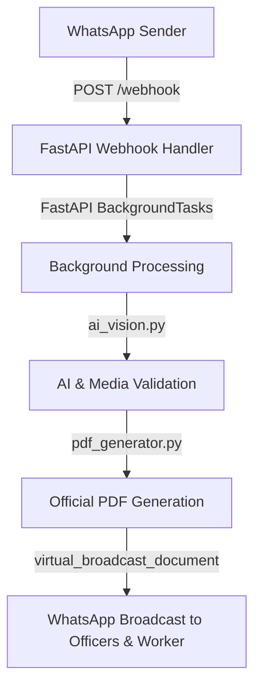

# BharatOS Shahdol Anganwadi DSS MVP — API Architecture Audit

## Executive Summary
This document presents an API Architecture Audit for the BharatOS District Shahdol Anganwadi Digital Verification System MVP.

Every endpoint in the system has been reviewed and classified into one of three architectural categories:
1. **Required for Pure WhatsApp MVP**
2. **Internal Officer/Admin API**
3. **Legacy / Unused**

---

## Core Workflow Verification

### Is the Core Workflow Independent of Dashboard APIs?
**YES, VERIFIED.**

The core digital verification workflow operates asynchronously and end-to-end via WhatsApp and background execution:

- **Webhook Ingestion**: Meta Cloud API calls `POST /webhook` with incoming media payload.
- **Background Execution**: `receive_webhook` enqueues `process_image_ai_pipeline` using FastAPI's non-blocking `BackgroundTasks`.
- **AI & Vision Validation**: `process_image_ai_pipeline` downloads media, validates integrity (PIL verify, size limit, path traversal), executes blur & brightness detection, extracts EXIF, and calculates pHash duplicate hashes.
- **PDF Generation**: `generate_daily_report_pdf()` formats the official government report.
- **Virtual Broadcast**: `virtual_broadcast_document()` sends the report PDF via WhatsApp directly to Worker, Supervisor, CDPO, CEO, and Collector.

**Conclusion**: The core automated workflow depends **ONLY** on the sequence above and has **ZERO dependency** on the Web Dashboard (`/dashboard`) or any `/api/v1/dashboard/*` and `/api/v1/reports/*` endpoints.

---

## Endpoint Classification & Detailed Evaluation

| Endpoint | Method | Category | Purpose | Current Workflow? | Safe to Keep? | Can Remove Later? | Government Demo? |
| --- | --- | --- | --- | --- | --- | --- | --- |
| `GET /` | GET | Required for Pure WhatsApp MVP | System Info & Status | Yes | Yes | No | Yes |
| `GET /health` | GET | Required for Pure WhatsApp MVP | Database & API Health Check | Yes | Yes | No | Yes |
| `GET /webhook` | GET | Required for Pure WhatsApp MVP | Meta Webhook Verification | Yes | Yes | No | Yes |
| `POST /webhook` | POST | Required for Pure WhatsApp MVP | Incoming WhatsApp Handler | Yes | Yes | No | Yes |
| `GET /dashboard` | GET | Internal Officer/Admin API | Web Review Panel HTML UI | Optional | Yes | Yes | Optional |
| `GET /api/v1/dashboard/stats` | GET | Internal Officer/Admin API | KPI Summary Statistics | Optional | Yes | Yes | Optional |
| `GET /api/v1/dashboard/submissions` | GET | Internal Officer/Admin API | Paginated Submissions List | Optional | Yes | Yes | Optional |
| `POST /api/v1/dashboard/submissions/{id}/review` | POST | Internal Officer/Admin API | Supervisor Approve/Flag Action | Optional | Yes | Yes | Optional |
| `GET /api/v1/reports/pdf` | GET | Internal Officer/Admin API | On-demand PDF Download | Optional | Yes | Yes | Optional |
| `GET /api/v1/reports/excel` | GET | Internal Officer/Admin API | On-demand CSV/Excel Export | Optional | Yes | Yes | Optional |

---

## Detailed Endpoint Breakdown

### 1. Required for Pure WhatsApp MVP

#### `GET /` — Root System Info
- **Purpose**: Returns application name, version, pilot district info, and status.
- **Used in current workflow?**: Yes (for sanity checks and uptime pings).
- **Safe to keep?**: Yes.
- **Can be removed later?**: No (Standard root status endpoint).
- **Used by Government Demo?**: Yes (Initial API verification).

#### `GET /health` — Health Check Endpoint
- **Purpose**: Checks SQLite/PostgreSQL database connectivity and WhatsApp API configuration.
- **Used in current workflow?**: Yes (Monitors system health).
- **Safe to keep?**: Yes.
- **Can be removed later?**: No (Essential for production monitoring).
- **Used by Government Demo?**: Yes (Demonstrates system readiness).

#### `GET /webhook` — Meta Webhook Verification
- **Purpose**: Responds to Meta Developer Console webhook challenge (`hub.challenge` and `hub.verify_token`).
- **Used in current workflow?**: Yes (Mandatory for Meta WhatsApp API setup).
- **Safe to keep?**: Yes.
- **Can be removed later?**: No (Meta will drop webhook connection without this).
- **Used by Government Demo?**: Yes (Required to link Meta Cloud API).

#### `POST /webhook` — Incoming WhatsApp Message Ingestion
- **Purpose**: Receives WhatsApp messages, authenticates sender, generates Audit ID (`SHD-YYYYMMDD-000001`), saves payload to DB, sends immediate Hindi auto-acknowledgement, and triggers background AI pipeline.
- **Used in current workflow?**: Yes (The core entry point of the entire system).
- **Safe to keep?**: Yes.
- **Can be removed later?**: No (Core functional route).
- **Used by Government Demo?**: Yes (Primary entry point for Anganwadi Workers).

---

### 2. Internal Officer / Admin API

#### `GET /dashboard` — Web Review Panel (HTML)
- **Purpose**: Serves the TailwindCSS + Vanilla JS web review interface for District Officers.
- **Used in current workflow?**: Optional (Allows web-based manual inspection).
- **Safe to keep?**: Yes (Adds visual UI value for district administration).
- **Can be removed later?**: Yes (If system transitions to 100% WhatsApp-only delivery).
- **Used by Government Demo?**: Optional (Useful for live screen presentations).

#### `GET /api/v1/dashboard/stats` — Dashboard KPI Stats
- **Purpose**: Aggregates total AWC reporting counts, approved, flagged, pending, and coverage % for today.
- **Used in current workflow?**: Optional (Powers summary cards on `/dashboard`).
- **Safe to keep?**: Yes.
- **Can be removed later?**: Yes (If web dashboard is retired).
- **Used by Government Demo?**: Optional.

#### `GET /api/v1/dashboard/submissions` — Paginated Submissions Query
- **Purpose**: Searches and filters daily submissions with status, block, date range, and pagination parameters.
- **Used in current workflow?**: Optional (Powers the data table on `/dashboard`).
- **Safe to keep?**: Yes.
- **Can be removed later?**: Yes.
- **Used by Government Demo?**: Optional.

#### `POST /api/v1/dashboard/submissions/{submission_id}/review` — Supervisor Manual Review
- **Purpose**: Allows a sector supervisor or CDPO to manually APPROVE or FLAG a submission with custom remarks.
- **Used in current workflow?**: Optional (Manual override for web users).
- **Safe to keep?**: Yes.
- **Can be removed later?**: Yes.
- **Used by Government Demo?**: Optional.

#### `GET /api/v1/reports/pdf` — On-Demand PDF Report Stream
- **Purpose**: Generates and streams the official A4 Government PDF Daily Report over HTTP.
- **Used in current workflow?**: Optional (On-demand web download; automated workflow uses internal `generate_daily_report_pdf`).
- **Safe to keep?**: Yes.
- **Can be removed later?**: Yes.
- **Used by Government Demo?**: Optional (Allows instant PDF preview in browser).

#### `GET /api/v1/reports/excel` — CSV / Excel Export Stream
- **Purpose**: Generates UTF-8 with BOM CSV file for Microsoft Excel containing all submission records.
- **Used in current workflow?**: Optional (Administrative data export).
- **Safe to keep?**: Yes.
- **Can be removed later?**: Yes.
- **Used by Government Demo?**: Optional.

---

### 3. Legacy / Unused Endpoints
- **None Identified.** All existing routes are actively structured into either the core WhatsApp ingestion workflow or the district officer administrative review panel. There are no dead or orphan endpoints in the codebase.

---

## Summary Recommendation
Keep all existing 10 endpoints in place. The core automated WhatsApp pipeline operates in complete isolation from the Web Dashboard APIs, ensuring zero runtime dependency while retaining full flexibility for district officer web review when needed.
